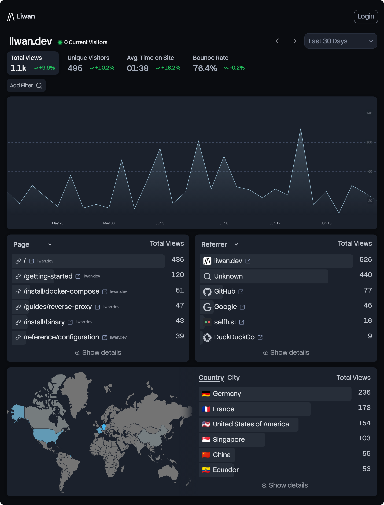
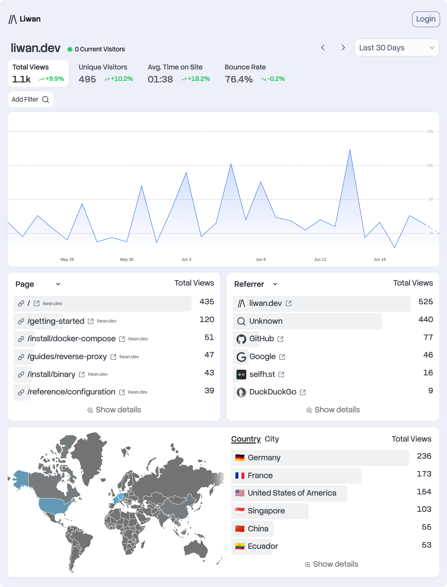

<br/>

<div align="center">
    <h2>
        
        <a href="https://liwan.dev">liwan.dev</a> - Easy & Privacy-First Web Analytics
    </h2>
    <div>


[](https://github.com/franzos/liwan/pkgs/container/liwan)

</div>

</div>

<div align="center">
<a href="https://demo.liwan.dev/p/liwan.dev"></a>&nbsp;&nbsp;&nbsp;
<a href="https://demo.liwan.dev/p/liwan.dev"></a>
</div>

## Features

- **Quick setup**\
  Quickly get started with Liwan with a single, self-contained binary . No database or complex setup required. The tracking script is a single line of code that works with any website and less than 1KB in size.
- **Privacy first**\
  Liwan respects your users’ privacy by default. No cookies, no cross-site tracking, no persistent identifiers. All data is stored on your server.
- **Lightweight**\
  You can run Liwan on a cheap VPS, your old mac mini, or even a Raspberry Pi. Written in Rust and using tokio for async I/O, Liwan is fast and efficient.
- **Open source**\
  Fully open source. You can change, extend, and contribute to the codebase.
- **Accurate data**\
  Get accurate data about your website’s visitors, page views, referrers, and more. Liwan detects bots and crawlers and filters them out by default.
- **Real-time analytics**\
  See your website’s traffic in real-time. Liwan updates the dashboard automatically as new visitors come in.

### OIDC/SSO

This fork focuses on OIDC/SSO login. For everything else - sites, users, roles, tracking, and the rest - see the docs at [liwan.dev/getting-started](https://liwan.dev/getting-started/).

Sign in with a username and password, or connect your identity provider over OIDC/SSO. With OIDC enabled, a "Sign in with SSO" button appears on the login page and accounts are provisioned automatically on first login. The username is taken from the provider's `preferred_username`, then a verified email, and — when neither is available — the user's name (e.g. `Jane Doe` → `jane-doe`), falling back to the opaque subject ID only as a last resort; either way, the account is matched on the provider's subject, so email or name changes never break the link. The first admin is created through a one-time setup flow, and accounts can also be managed from the CLI.

#### Configuration

Liwan reads a single TOML file. It looks for `./liwan.config.toml`, then `$XDG_CONFIG_HOME/liwan/config.toml` (i.e. `~/.config/liwan/config.toml`), or you can point it at an explicit path with `--config <path>` or the `LIWAN_CONFIG` env var. Any value can also be overridden with a `LIWAN_*` environment variable (e.g. `LIWAN_OIDC_CLIENT_SECRET`), which is the recommended way to pass secrets. A fully annotated example lives in [`data/config.example.toml`](data/config.example.toml).

```toml
base_url = "https://analytics.example.com"  # external URL of this instance (used to build the OIDC redirect URI)
listen   = 9042                             # local http port to bind, typically behind a reverse proxy
# data_dir = "./liwan-data"                 # defaults to ~/.local/share/liwan/data
```

#### OpenID Connect (OIDC)

Add an `[oidc]` section to enable SSO. It only activates once `issuer`, `client_id`, and `client_secret` are all set — at which point a "Sign in with SSO" button appears on the login page. Password login keeps working alongside it.

```toml
[oidc]
issuer        = "https://idp.example.com"        # discovery base; /.well-known/openid-configuration is appended
client_id     = "liwan"
client_secret = "..."                            # prefer the LIWAN_OIDC_CLIENT_SECRET env var
scopes        = ["openid", "email", "profile"]   # optional; this is the default
button_label  = "Sign in with SSO"               # optional; label on the login button
```

Register this redirect URI with your provider (derived from `base_url`):

```
<base_url>/api/dashboard/auth/oidc/callback
```

First-time SSO users are created as regular users with no project access until an admin grants it; usernames are derived from the OIDC claims as described above. Accounts are matched on the provider's subject, so a later email or name change never breaks the link.

#### Restricting who can register

By default any user your IdP authenticates gets a local account on first login. Two options narrow that — they gate **first-time provisioning only**, so returning users (matched on the provider's subject) always log in regardless:

```toml
[oidc]
# ... issuer, client_id, client_secret as above ...

# open (default) | closed | domain_allowlist
registration    = "domain_allowlist"
allowed_domains = ["example.com", "acme.org"]    # required for domain_allowlist
```

- **`closed`** — no new accounts; only users who already exist can log in. Handy once everyone intended is enrolled.
- **`domain_allowlist`** — new accounts only for users whose **verified** email is in `allowed_domains`. An unverified email never qualifies, so the `email` scope is required. Matching is exact and case-insensitive — subdomains do not match (`example.com` excludes `sub.example.com`). The trust here assumes your single configured `issuer` is authoritative for those domains. Configure non-ASCII (IDN) domains in punycode.

Rejections send the user back to the login page with a short explanation. Both fields also accept env overrides (`LIWAN_OIDC_REGISTRATION`, `LIWAN_OIDC_ALLOWED_DOMAINS` as a comma-separated list).

### Importing from Matomo

Liwan can import historical pageviews from a Matomo instance. The importer is opt-in at build time — default builds don't include it:

```bash
cargo build --release --features import-matomo
```

You need Matomo 5.0 or newer (the importer checks before doing anything else), an API token, and the liwan server must be **stopped** — DuckDB allows a single writer, the same limitation `prune` has.

```bash
MATOMO_TOKEN=... liwan import matomo \
  --url https://matomo.example.com \
  --site 3=blog --site 7=docs \
  --since 2022-01-01
```

- `--site <idSite>=<entity_id>` maps a Matomo site to a liwan entity. Repeatable; one entity per site, and the entity must already exist.
- `--since YYYY-MM-DD` is required on the first run per site.
- The token can also be passed with `--token`, but prefer `MATOMO_TOKEN` — CLI arguments leak via `ps` and shell history.
- `--page-size <n>` sets visits per API request (default 1000); `--dry-run` fetches and maps without writing anything.
- `--drop-local-urls` skips pageviews whose URL host is `localhost` or a private/reserved IP (e.g. `127.0.0.1`) — useful for filtering local development traffic that was tracked into Matomo. Off by default, to match live tracking (which keeps these).
- `--max-retries`, `--retry-base-delay` (seconds) and `--page-delay` (milliseconds) tune rate-limit handling. A 429 (or a transient 5xx/timeout) backs off exponentially and retries instead of aborting the site; `--page-delay` adds a fixed pause between pages so a large site self-throttles before it ever hits the limit.

#### Batch import against a Docker deployment

When liwan runs in Docker, the same single-writer rule applies: stop the service, run a one-off importer container with `docker compose run`, then start it again. A small wrapper handles a list of sites, a cooldown between them, and Ctrl-C:

```bash
#!/usr/bin/env bash
set -euo pipefail

# DuckDB is single-writer — the server has to be down while we import.
# Restart it on Ctrl-C so an abort doesn't leave tracking offline.
trap 'echo; echo "Aborted."; docker compose start liwan; exit 130' INT

COOLDOWN="${COOLDOWN:-15}"   # seconds between sites, so Matomo doesn't 429 the next import

run() {
    docker compose run --rm -e MATOMO_TOKEN liwan \
        import matomo \
        --url https://matomo.example.com \
        --site "$1" \
        --since 2022-01-01 \
        --page-delay 250
    sleep "$COOLDOWN"
}

docker compose stop liwan        # release the DB writer lock
run 3=blog
run 7=docs
docker compose start liwan       # bring tracking back up
```

Export the token in the parent shell first (`export MATOMO_TOKEN=...`) so `-e MATOMO_TOKEN` passes it through without baking it into the script. Replace `liwan` with your compose service name. Because re-runs are incremental, a site that 429s past its retries can just be run again — it resumes from its checkpoint.

Re-runs are incremental. The importer keeps a per-site checkpoint file under `<data_dir>/import/` and only fetches what's newer, in month-sized chunks. There's a one-hour lateness allowance: actions that arrive in Matomo more than about an hour after the fact (QueuedTracking, log importer) fall below the watermark and won't be picked up by later runs. To re-import from scratch, delete the checkpoint file and run again with `--since` — that's safe, since resuming first deletes previously imported rows newer than the watermark.

The importer refuses to run when the target entity has day-based data retention or a drop rule that would discard every imported event — the next prune would just delete the history again. `--force` overrides this if you know what you're doing.

Do expect the numbers to differ from Matomo's own, and from live liwan tracking:

- Cookieless Matomo sites count uniques per day, so liwan shows more unique visitors over multi-day ranges. Imported visitors are also distinct from live visitors — someone tracked by both appears twice.
- Only pageviews are imported; downloads, events, and goals between pageviews are dropped, which skews bounce rate and time-on-site (bounce rate generally higher).
- Time-on-site isn't comparable to Matomo's: liwan averages the gap between consecutive pageviews (single-page sessions excluded), while Matomo divides total visit length by all visits (bounces counted as zero). On bounce-heavy sites liwan's figure reads much higher. This is how liwan computes the metric for live data too, not an import artifact.
- Bot filtering is Matomo's, not liwan's. Device and OS mapping is best-effort. City names can differ between GeoIP databases.

## Fork

This is a fork of [explodingcamera/liwan](https://github.com/explodingcamera/liwan), adding support for an OIDC/OAuth login flow.

## License

Unless otherwise noted, the code in this repository is available under the terms of the Apache-2.0 license. See [LICENSE](LICENSE.md) for more information.
